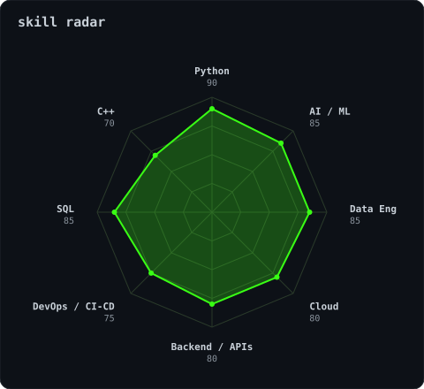
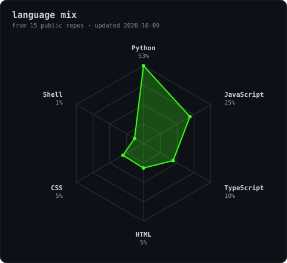
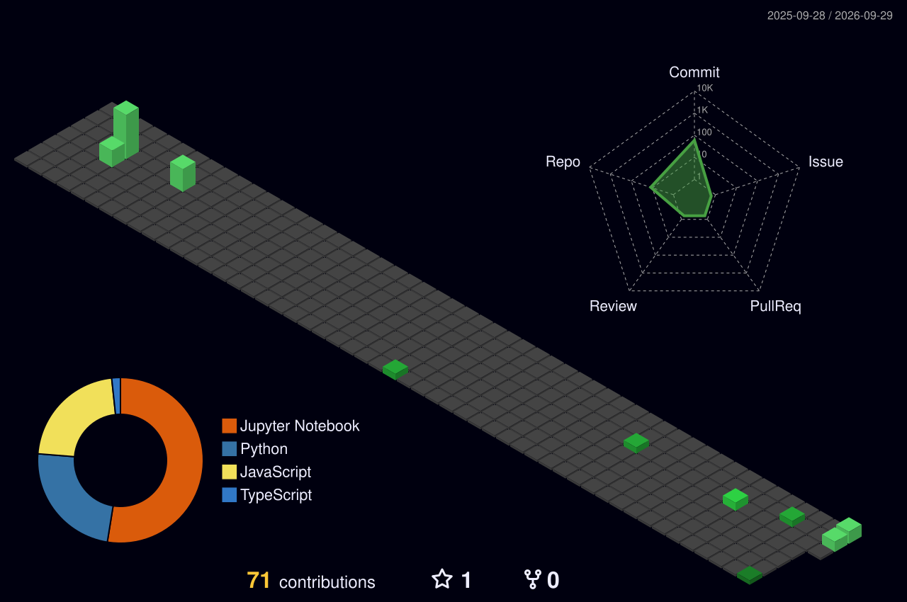

<div align="center">


[](https://linkedin.com/in/YOUR_LINKEDIN)
[](mailto:shyamharish2004@gmail.com)
[](https://YOUR_PORTFOLIO_URL)
[](https://leetcode.com/u/YOUR_LEETCODE)
[](https://codeforces.com/profile/YOUR_CODEFORCES)


</div>

### ~/ whoami

```bash
$ cat about.txt
Hi, I'm Harish. I build things that sit between the web and data,
and I like turning ideas into working products.

• Currently building : Instaclone — a MERN + Socket.io Instagram clone
• Learning           : React, Node.js and Machine Learning
• Fun fact           : YOUR_FUN_FACT
```

### ~/ toolbox

<p>
  
</p>

### ~/ skills

<p align="center">
  
  
</p>

### ~/ streaks

<p align="center">
  
</p>

### ~/ contribution calendar


